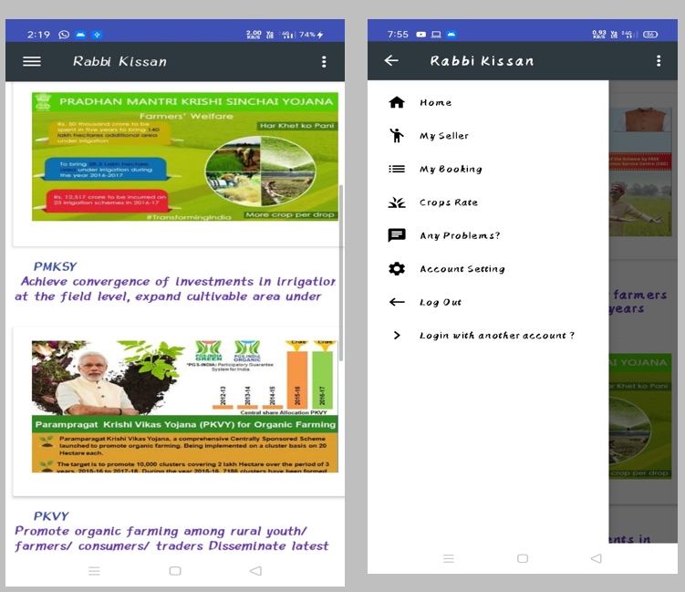

# RabbiKissan
It is a technology-based agriculture android app specially made for Indian farmers which helps them take critical decisions in their farming business to increase profitability.  It ensures a fair price to the farming community by devising new techniques and by making use of the online market. An application that serves as a platform for movements of agricultural products form the farmers directly to the consumers or retailers. This mobile android app provides privilege for both farmers and consumers or retailers to buy or sell the required farm products without the involvement of a middleman at its right profitable price.

## Front
[Optional Text](RabbiKisaan/front.png)

## Homepage

